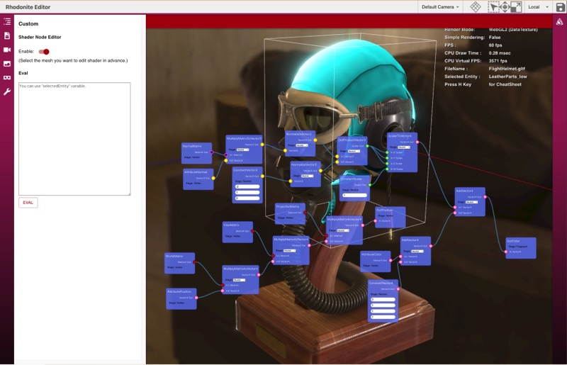

import DocLayout from '../../../../components/docs_layouts/DocLayout.astro';

<DocLayout>


Rhodonite's shader design consists of three main components

* Materials
* Parameter passing classes
* Shader code


## Materials

In Rhodonite, each Mesh has one or more Primitives, and each Primitive always has one Material.
Rhodonite's Material is the WebGL equivalent of a shader program (vertex shaders and fragment shaders combined).
The material instance can be set to specific values of shader parameters (base color, etc.) using the setParameter method or other methods.

## 2 shader code construction methods

Rhodonite offers the following two methods for building shader code.

* [Shaderity](https://github.com/actnwit/shaderity)-based
* Node editor

In Rhodonite, shaders can be developed using any of these two shader mechanisms.

## TypeScript class-based

This is a mechanism where fragments of shader code are embedded as strings in a TypeScript class and combined to build the final shader code.
This was the mechanism built in the early development of Rhodonite, but it is now deprecated and many material shader codes have already migrated to the Shaderity base. In addition, we plan to move to a node editor base in the future.

## Shaderity-based

This is currently the predominant shader creation method in Rhodonite.
This is a mechanism for building shaders using [Shaderity](https://github.com/actnwit/shaderity), a shader utility library that is being developed as a separate project from Rhodonite.
Shaderity is a shader development support library with code binding function by shader import function and utility functions such as code conversion.
In the Shaderity base, shaders are generated by creating a regular GLSL file and importing it into the Rhodonite library using Shaderity's loader for esbuild.
In doing so, you can use Shaderity's import feature to build shaders from files with multiple GLSL code fragments.


### How to write Shaderity-based GLSL

Below is the pixel shader content of Rhodonite's Classic shader.

```glsl
/* shaderity: @{enableVertexExtensions} */
/* shaderity: @{glslPrecision} */

/* shaderity: @{definitions} */

#ifdef WEBGL2_MULTI_VIEW
  layout(num_views=2) in;
#endif

/* shaderity: @{vertexInOut} */
out vec4 v_shadowCoord;

uniform float u_pointSize; // initialValue=30
uniform vec3 u_pointDistanceAttenuation; // initialValue=(0,0.1,0.01)

// BiasMatrix * LightProjectionMatrix * LightViewMatrix, See: http://www.opengl-tutorial.org/intermediate-tutorials/tutorial-16-shadow-mapping/#basic-shader
uniform mat4 u_depthBiasPV; // initialValue=(1,0,0,0,0,1,0,0,0,0,1,0,0,0,0,1)

#pragma shaderity: require(../common/morphVariables.glsl)

/* shaderity: @{prerequisites} */

/* shaderity: @{getters} */

/* shaderity: @{matricesGetters} */

/* shaderity: @{processGeometry} */

void main()
{

/* shaderity: @{mainPrerequisites} */

  mat4 worldMatrix = get_worldMatrix(a_instanceInfo.x);
  mat4 viewMatrix = get_viewMatrix(cameraSID, 0);
  mat4 projectionMatrix = get_projectionMatrix(cameraSID, 0);
  mat3 normalMatrix = get_normalMatrix(a_instanceInfo.x);
  bool isBillboard = get_isBillboard(a_instanceInfo.x);

  // Skeletal
  processGeometry(
    skeletalComponentSID,
    worldMatrix,
    viewMatrix,
    isBillboard,
    normalMatrix,
    normalMatrix,
    a_position,
    v_position_inWorld,
    a_normal,
    v_normal_inWorld
  );

  gl_Position = projectionMatrix * viewMatrix * v_position_inWorld;

  v_color = a_color;
  v_normal_inWorld = normalMatrix * a_normal;
  v_texcoord_0 = a_texcoord_0;
  v_baryCentricCoord = a_baryCentricCoord.xyz;

  v_shadowCoord = get_depthBiasPV(materialSID, 0) * v_position_inWorld;
}
```

The following pragma syntax can be used to read an external glsl file. This is statically resolved by the bundler.

```
#pragma shaderity: require(./foo.glsl)
```

On the other hand, the following comment syntax is resolved dynamically by Rhodonite, and the contents of a variable called getters inside Rhodonite are expanded here.

```glsl
/* shaderity: @{getters} */
```

Also, the following uniform variable declarations are actually converted to parameter passing via floating point texture rather than uniform if DataTexture is used for the rendering approach. Various additional information can also be given in comments after the declaration.

```
uniform int u_shadingModel; // initialValue=0
uniform float u_alphaCutoff; // initialValue=0.01
uniform float u_shininess; // initialValue=5
uniform vec4 u_diffuseColorFactor; // initialValue=(1,1,1,1)
uniform sampler2D u_diffuseColorTexture; // initialValue=(0,white)
uniform sampler2D u_normalTexture; // initialValue=(1,blue)
uniform vec4 u_diffuseColorTextureTransform; // initialValue=(1,1,0,0)
uniform float u_diffuseColorTextureRotation; // initialValue=0
```

For example, the comment `// initialValue=` can be used to give an initial value to that shader parameter.

```
uniform int u_shadingModel; // initialValue=0
```

Shaderity's own syntax is written in pragma or comment form, so the Shaderity code as a whole does not deviate from the GLSL syntax.

## Node Editor

Rhodonite has its own node system that allows real-time construction of shaders through node editing (under development).



</DocLayout>
