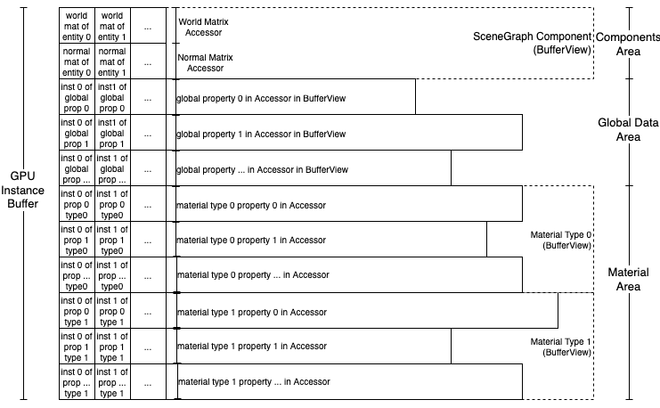

import DocLayout from '../../../../components/docs_layouts/DocLayout.astro';

<DocLayout>

## What is Rhodonite?

Rhodonite is a web3D library written in TypeScript.

## Rhodonite Features

### Component Oriented

It employs a component-oriented design, which is also seen in the Unity game engine.
By having entities, which are entities in the 3D space, carry various components, "objects" are given functions.

A component is a minimal unit of various functions that gives an "object" capabilities, and is represented by a TypeScript class.

Components, which are the unit of functionality, are mounted on entities, which are the containers, to increase their functionality.

This approach is superior to classical class inheritance programming in terms of flexibility and code maintainability. It is the predominant design approach in today's game engines.

### Blittable Memory Architecture

Each member variable of Rhodonite's component classes is memory contiguous.

Rhodonite first obtains a huge ArrayBuffer memory pool and assigns memory from that pool to each field member of the component.
Each field member is memory contiguous across entities (potentially taking other memory layouts), which helps improve CPU cache memory hit rates.

In addition, this huge memory pool can be sent to the GPU as textures all at once before rendering, and multiple meshes can be drawn as instances for fast scene rendering.
The shaders obtain the location and material information from the texture where each entity is drawn. This is called the blittable memory architecture in Rhodonite.



In WebGL, updating uniform variables is always a major performance bottleneck.
The blittable memory architecture avoids this bottleneck by sending all data to the GPU at once as a texture without using setUniform.

This mechanism provides particularly high performance when a large number of geometry batches must be drawn (instance drawing) with a relatively small number of polygons.
Even in the case of non-instance rendering, the system avoids heavy setUniform-type processing, resulting in higher performance in many cases than with normal rendering methods.

It is also suitable for cases where shaders must access complex and large amounts of data, such as in games.

## PBR (Physically Based Rendering) Support

Rhodonite supports PBR (Physically Based Rendering).

By combining PBR materials in the glTF2 format and .hdr images for IBL (Image Based Lighting), it achieves very realistic rendering.


## glTF2 Format Support

Rhodonite supports the glTF2 format.

glTF2 is a format for representing scene data for 3D games and apps.

Rhodonite supports the following extensions of glTF2:

- [x] KHR_animation_pointer
- [x] KHR_draco_mesh_compression
- [x] KHR_lights_punctual
- [x] KHR_materials_anisotropy
- [x] KHR_materials_clearcoat
- [x] KHR_materials_dispersion
- [x] KHR_materials_emissive_strength
- [x] KHR_materials_ior
- [x] KHR_materials_iridescence
- [x] KHR_materials_sheen
- [x] KHR_materials_specular
- [x] KHR_materials_transmission
- [x] KHR_materials_unlit
- [x] KHR_materials_variant
- [x] KHR_materials_volume
- [x] KHR_texture_basisu
- [x] KHR_texture_transform

## VRM Format Support

Rhodonite supports the VRM format.

VRM is a format for representing 3D avatars based on glTF2.

Rhodonite supports both VRM0.x and VRM1.0.


## Rhodonite Introduction

The following Listing 1-1 shows the minimum code for polygon display in Rhodonite at this time.

```typescript
import Rn from "rhodonite";

(async () => {
  // Initialize Rhodonite. Specify the drawing method (Uniform in this case) and the canvas to draw on
  await Rn.System.init({
    approach: Rn.ProcessApproach.DataTexture,
    canvas: document.getElementById("world") as HTMLCanvasElement,
  });

  // Create an entity with components
  const firstEntity = Rn.createMeshEntity();

  // Create vertex data
  const indices = new Uint32Array([0, 1, 3, 3, 1, 2]);

  const positions = new Float32Array([
    -0.5, -0.5, 0.0, 0.5, -0.5, 0.0, 0.5, 0.5, 0.0, -0.5, 0.5, 0.0,
  ]);

  const colors = new Float32Array([
    0.0, 1.0, 1.0, 1.0, 1.0, 0.0, 1.0, 0.0, 0.0, 0.0, 0.0, 1.0,
  ]);

  // Create a Primitive object by specifying the vertex data
  const primitive = Rn.Primitive.createPrimitive({
    indices: indices,
    attributeSemantics: [
      Rn.VertexAttribute.Position.XYZ,
      Rn.VertexAttribute.Color0.XYZ,
    ],
    attributes: [positions, colors],
    primitiveMode: Rn.PrimitiveMode.Triangles,
  });

  // Add the Primitive to the Mesh component of the entity
  const meshComponent = firstEntity.getMesh();
  const mesh = new Rn.Mesh();
  mesh.addPrimitive(primitive);
  meshComponent.setMesh(mesh);

  // Render the scene.
  // The existence of the entity is internally managed by Rhodonite at the time of creation, so the programmer does not need to explicitly register the entity with the system.
  Rn.System.startRenderLoop(() => {
    Rn.System.processAuto();
  });
})();
```
List 1-1

<iframe src="https://codesandbox.io/embed/j5pyv8?view=preview&module=%2Fsrc%2Findex.ts"
    style="width:100%; height: 500px; border:0; border-radius: 4px; overflow:hidden;"
    title="Rhodonite_example"
    allow="accelerometer; ambient-light-sensor; camera; encrypted-media; geolocation; gyroscope; hid; microphone; midi; payment; usb; vr; xr-spatial-tracking"
    sandbox="allow-forms allow-modals allow-popups allow-presentation allow-same-origin allow-scripts"
></iframe>

The design of the Primitive class is designed to conceptually fit the glTF2 format.

</DocLayout>
