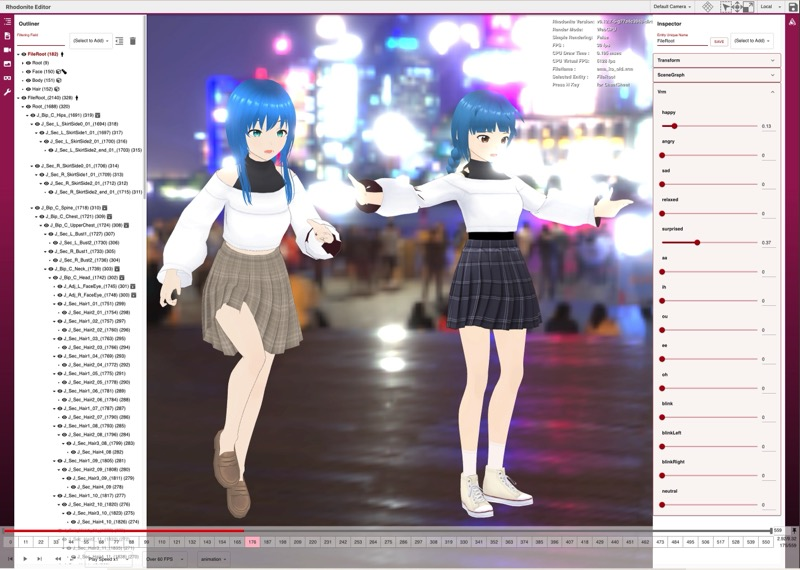

import DocLayout from '../../../../components/docs_layouts/DocLayout.astro';

<DocLayout>

## Rhodoniteとは

Rhodonite（ロードナイト）はTypeScriptで書かれたWeb3Dライブラリです。

## Rhodoniteの特徴

### コンポーネント指向

Unityゲームエンジンなどにもみられるコンポーネント指向設計を採用しています。
３D空間上における実体であるエンティティに各種コンポーネントを搭載させることにより、「物体」に機能をもたせます。

コンポーネントは「物体」に能力を与える、各種機能の最小限の単位であり、TypeScriptのクラスで表されます。

機能の単位であるコンポーネントを入れ物であるエンティティに搭載させることで機能を増やしていきます。

このアプローチは古典的なクラス継承プログラミングよりも柔軟性やコードメンテナンス性においてより優れています。今日のゲームエンジンで主流の設計アプローチです。

### ブリッタブルメモリアーキテクチャ

Rhodoniteのコンポーネントクラスの各メンバ変数は、メモリ的に連続しています。

Rhodoniteは最初に巨大なArrayBufferのメモリプールを取得し、そのプールからコンポーネントの各フィールドメンバーにメモリをアサインします。
各フィールドメンバーは、エンティティ間でメモリ連続である（他のメモリレイアウトを取ることも潜在的には可能です）ため、CPUのキャッシュメモリのヒット率向上に貢献しています。

また、この巨大なメモリプールをレンダリング前にGPUへテクスチャとして一気に送信し、複数メッシュをインスタンス描画することで高速なシーン描画を行うことができます。
各エンティティが描かれる位置情報やマテリアル情報などは、シェーダーがそのテクスチャから取得します。これをRhodoniteではブリッタブルメモリアーキテクチャと呼んでいます。


WebGLではUniform変数の更新が常に性能上の大きなボトルネックになります。
ブリッタブルメモリアーキテクチャでは、setUniformを使わずに全てのデータをテクスチャとしてGPUに一気に送りこむため、このボトルネックを回避できます。

この仕組みは、比較的少ないポリゴン数で、多くのジオメトリバッチを大量に描画（インスタンス描画）しなければならない場合に特に高い性能を発揮します。
非インスタンス描画の場合でも、重たいsetUniform系の処理を回避できるため、通常の描画方法よりも多くのケースで高性能です。

また、ゲームなどのように、複雑かつ大量のデータにシェーダーがアクセスしなければならない場合にも適しています。

## 高度なPBR(物理ベースレンダリング)への対応

Rhodoniteは物理ベースレンダリングに対応しています。

後述するglTF2フォーマットのPBRマテリアルと.hdr画像によるIBL(Image Based Lighting)を組み合わせることで、とてもリアルなレンダリングを実現します。


## glTF2フォーマットのサポート

RhodoniteはglTF2フォーマットをサポートしています。

glTF2フォーマットは、3Dゲームやアプリのシーンデータを表現するためのフォーマットです。

RhodoniteはglTF2の以下の拡張形式をサポートしています

- [x] KHR_animation_pointer
- [x] KHR_draco_mesh_compression
- [x] KHR_lights_punctual
- [x] KHR_materials_anisotropy
- [x] KHR_materials_clearcoat
- [x] KHR_materials_dispersion
- [x] KHR_materials_emissive_strength
- [x] KHR_materials_ior
- [x] KHR_materials_iridescence
- [x] KHR_materials_sheen
- [x] KHR_materials_specular
- [x] KHR_materials_transmission
- [x] KHR_materials_unlit
- [x] KHR_materials_variant
- [x] KHR_materials_volume
- [x] KHR_materials_diffuse_transmission
- [x] KHR_texture_basisu
- [x] KHR_texture_transform

## VRMフォーマットのサポート

RhodoniteはVRMフォーマットをサポートしています。

VRMフォーマットは、glTF2に基づく、3Dアバターフォーマットです。

RhodoniteはVRM0.xとVRM1.0の両方をサポートしています。
また、VRM用のアニメーションフォーマットとしてVRMA (VRM Animation) をサポートしています。



## Rhodoniteことはじめ

次のリスト1-1は、現時点でのRhodoniteにおけるポリゴン表示のための最小コードです。

```typescript
import Rn from "rhodonite";

(async () => {
  // Rhodoniteの初期化。描画処理方法（今回はUniform）と描画先canvasを指定
  await Rn.System.init({
    approach: Rn.ProcessApproach.DataTexture,
    canvas: document.getElementById("world") as HTMLCanvasElement,
  });

  // Component搭載済みEntityの作成
  const firstEntity = Rn.createMeshEntity();

  // 頂点データの作成
  const indices = new Uint32Array([0, 1, 3, 3, 1, 2]);

  const positions = new Float32Array([
    -0.5, -0.5, 0.0, 0.5, -0.5, 0.0, 0.5, 0.5, 0.0, -0.5, 0.5, 0.0,
  ]);

  const colors = new Float32Array([
    0.0, 1.0, 1.0, 1.0, 1.0, 0.0, 1.0, 0.0, 0.0, 0.0, 0.0, 1.0,
  ]);

  // 頂点データを指定してPrimitiveオブジェクトを作成
  const primitive = Rn.Primitive.createPrimitive({
    indices: indices,
    attributeSemantics: [
      Rn.VertexAttribute.Position.XYZ,
      Rn.VertexAttribute.Color0.XYZ,
    ],
    attributes: [positions, colors],
    primitiveMode: Rn.PrimitiveMode.Triangles,
  });

  // EntityのMeshコンポーネントにPrimitiveを追加
  const meshComponent = firstEntity.getMesh();
  const mesh = new Rn.Mesh();
  mesh.addPrimitive(primitive);
  meshComponent.setMesh(mesh);

  // 描画する。
  // Entityの存在は作成した時点でRhodoniteが内部的に把握しているため、プログラマが明示的にシステムにEntityを登録する必要はありません。
  Rn.System.startRenderLoop(() => {
    Rn.System.processAuto();
  });
})();
```
List 1-1

<iframe src="https://codesandbox.io/embed/j5pyv8?view=preview&module=%2Fsrc%2Findex.ts"
    style="width:100%; height: 500px; border:0; border-radius: 4px; overflow:hidden;"
    title="Rhodonite_example"
    allow="accelerometer; ambient-light-sensor; camera; encrypted-media; geolocation; gyroscope; hid; microphone; midi; payment; usb; vr; xr-spatial-tracking"
    sandbox="allow-forms allow-modals allow-popups allow-presentation allow-same-origin allow-scripts"
></iframe>

Primitiveクラスの設計はglTF2フォーマットに概念的に合うよう設計されています。

</DocLayout>
