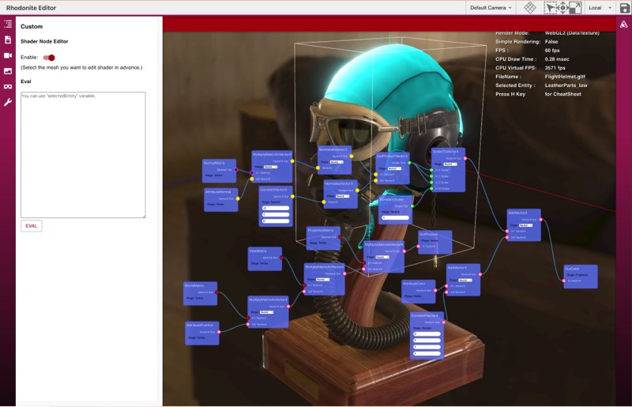

import DocLayout from '../../../components/docs_layouts/DocLayout.astro';

<DocLayout>

Rhodoniteのシェーダー設計は主に次の３つから成り立っています。

* マテリアル
* パラメータ受け渡しクラス
* シェーダーコード


## マテリアル

Rhodoniteでは、Meshが１つまたは複数のPrimitiveを持ち、それぞれのPrimitiveが必ず１つのMaterialを持ちます。
RhodoniteのMaterialはWebGLで例えるならシェーダープログラム（頂点シェーダーやフラグメントシェーダーをあわせたもの）に相当します。
Materialインスタンスには、setParameterメソッドなどで、そのマテリアル（シェーダー）が持つシェーダーパラメーターの具体的な値（ベースカラー等）を設定することができます。

## ２つのシェーダーコード構築方法

Rhodoniteには以下の2つのシェーダーコードの構築方法があります。

* [Shaderity](https://github.com/actnwit/shaderity)ベース
* ノードエディタ

Rhodoniteでは、この2つのシェーダー機構どちらを使ってもシェーダーを開発できます。

## Shaderityベース

Rhodoniteで現在主流のシェーダー作成方法になります。
Rhodoniteとは別プロジェクトとして開発しているShaderユーティリティライブラリ「[Shaderity](https://github.com/actnwit/shaderity)」を利用してシェーダーを構築する機構です。
Shaderityとは、シェーダーのインポート機能によるコード結合機能と、コード変換等のユーティリティ機能を備えたシェーダー開発支援ライブラリです。
Shaderityベースでは通常のGLSLファイルを作成し、それをShaderityのWebPack向けローダーを使って、Rhodoniteライブラリ内に取り込むことでシェーダーを生成します。
その際に、Shaderityのインポート機能を使うことで、複数のGLSLコード断片のファイルからシェーダーを構築できます。

### ShaderityベースのGLSLの書き方

以下はRhodoniteのClassicシェーダーのピクセルシェーダーの内容です。

```glsl

/* shaderity: @{enableVertexExtensions} */
/* shaderity: @{glslPrecision} */

/* shaderity: @{definitions} */

#ifdef WEBGL2_MULTI_VIEW
  layout(num_views=2) in;
#endif

/* shaderity: @{vertexInOut} */
out vec4 v_shadowCoord;

uniform float u_pointSize; // initialValue=30
uniform vec3 u_pointDistanceAttenuation; // initialValue=(0,0.1,0.01)

// BiasMatrix * LightProjectionMatrix * LightViewMatrix, See: http://www.opengl-tutorial.org/intermediate-tutorials/tutorial-16-shadow-mapping/#basic-shader
uniform mat4 u_depthBiasPV; // initialValue=(1,0,0,0,0,1,0,0,0,0,1,0,0,0,0,1)

#pragma shaderity: require(../common/morphVariables.glsl)

/* shaderity: @{prerequisites} */

/* shaderity: @{getters} */

/* shaderity: @{matricesGetters} */

/* shaderity: @{processGeometry} */

void main()
{

/* shaderity: @{mainPrerequisites} */

  mat4 worldMatrix = get_worldMatrix(a_instanceInfo.x);
  mat4 viewMatrix = get_viewMatrix(cameraSID, 0);
  mat4 projectionMatrix = get_projectionMatrix(cameraSID, 0);
  mat3 normalMatrix = get_normalMatrix(a_instanceInfo.x);
  bool isBillboard = get_isBillboard(a_instanceInfo.x);

  // Skeletal
  processGeometry(
    skeletalComponentSID,
    worldMatrix,
    viewMatrix,
    isBillboard,
    normalMatrix,
    normalMatrix,
    a_position,
    v_position_inWorld,
    a_normal,
    v_normal_inWorld
  );

  gl_Position = projectionMatrix * viewMatrix * v_position_inWorld;

  v_color = a_color;
  v_normal_inWorld = normalMatrix * a_normal;
  v_texcoord_0 = a_texcoord_0;
  v_baryCentricCoord = a_baryCentricCoord.xyz;

  v_shadowCoord = get_depthBiasPV(materialSID, 0) * v_position_inWorld;
}
```

次のpragma構文で、外部のglslファイルを読み込むことができます。これはバンドラーによって静的に解決されます。

```
#pragma shaderity: require(./foo.glsl)
```

一方、次のコメント構文は、Rhodoniteによって動的に解決され、Rhodonite内部のgettersという変数の内容がここに展開されます。

```glsl
/* shaderity: @{getters} */
```

また、以下のuniform変数宣言は、レンダリングアプローチにDataTextureを用いている場合、実際にはUniformではなく浮動小数点テクスチャ経由のパラメーター渡しに変換されます。また、宣言の後ろにコメントでさまざまな付加情報を与えることができます。

```
uniform int u_shadingModel; // initialValue=0
uniform float u_alphaCutoff; // initialValue=0.01
uniform float u_shininess; // initialValue=5
uniform vec4 u_diffuseColorFactor; // initialValue=(1,1,1,1)
uniform sampler2D u_diffuseColorTexture; // initialValue=(0,white)
uniform sampler2D u_normalTexture; // initialValue=(1,blue)
uniform vec4 u_diffuseColorTextureTransform; // initialValue=(1,1,0,0)
uniform float u_diffuseColorTextureRotation; // initialValue=0
```

例えば`// initialValue=`というコメントによって、そのシェーダーパラメータに初期値を与えることができます。

```
uniform int u_shadingModel; // initialValue=0
```

Shaderity独自の構文はpragmaまたはコメント形式で記述されるため、Shaderityコード全体としてはGLSLの文法から逸脱しないものになっています。

## ノードエディタ

Rhodoniteは独自のノードシステムを搭載しており、ノード編集によってシェーダーのリアルタイム構築が可能です（開発中です）。



</DocLayout>
